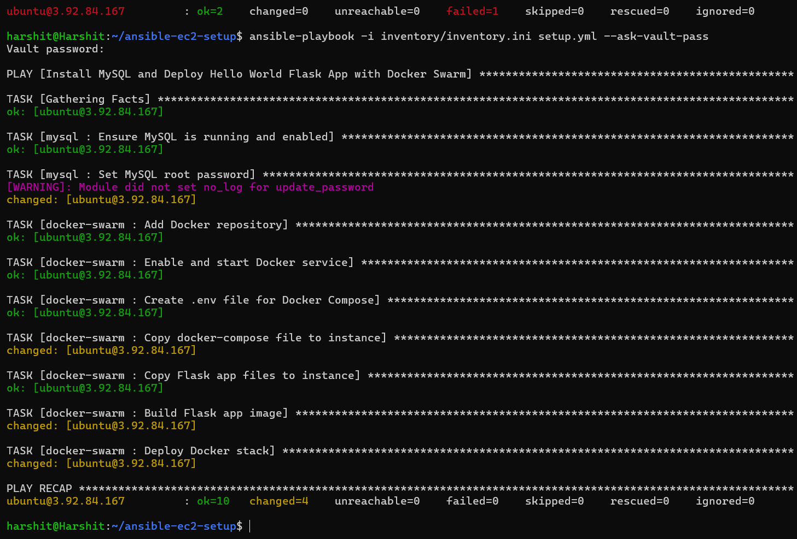
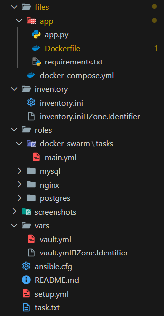
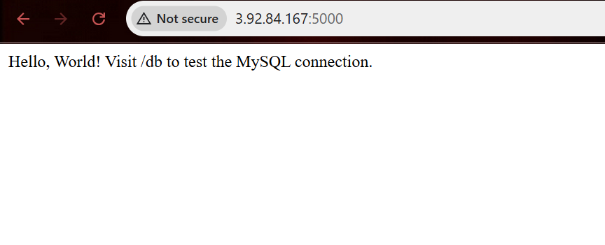
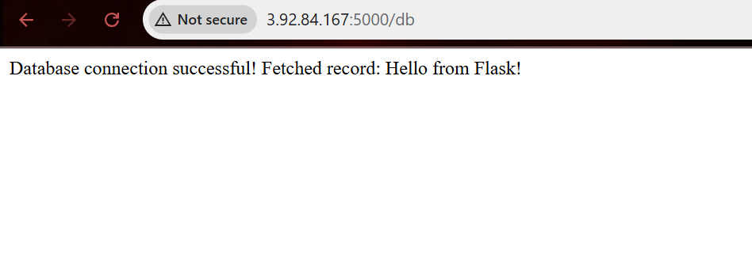

# 🚀 Ansible EC2 + Flask + MySQL, Hello World Application

This project demonstrates how to automate the setup of an EC2 instance using **Ansible** to install and configure Mysql. Later, Dockerize the Flask App ensuring connection with MySQL and hosting on port 5000:

- ✅ MySQL
- ✅ Flask
- 🔐 With **secure passwords** using Ansible Vault

## 

## 📁 Project Structure



---

## ✅ Part 1: Launch EC2 Manually (Ubuntu 22.04)

1. Go to AWS Console → EC2 → Launch Instance
2. Fill in:
   - **Name**: `ansible-demo`
   - **AMI**: Ubuntu 22.04 LTS
   - **Instance type**: `t2.micro`
   - **Key Pair**: Create/download `.pem` file
3. Under **Security Group**, allow:
   - SSH (22)
   - HTTP (80)
   - MySQL (3306)
   - Allow All traffic
4. Click **Launch**
5. After launch, copy the **Public IPv4** of your EC2

---

## ✅ Part 2: Connect to EC2 (Local Machine)

```bash
chmod 400 your-key.pem
ssh -i your-key.pem ubuntu@<ec2-public-ip>
```

## Part 3: Install Ansible (Local Machine) and setup

```bash
sudo apt update
sudo apt install ansible -y
mkdir ansible-ec2-setup
cd ansible-ec2-setup
touch setup.yml inventory.ini
```

## Part 4: Create setup.yml

Define Roles to follow and your ansible vault location

## Part 5: Create inventory.ini

```bash
mkdir inventory
cd inventory
touch inventory.ini
```

Write the following in inventory.ini

```bash
[ec2]
ubuntu@<your-ec2-public-ip> ansible_ssh_private_key_file=~/.ssh/your-key.pem ansible_user=ubuntu
```

## Part 6: Create Roles - mysql

```bash
mkdir roles/mysql
cd roles/mysql
touch main.yml # write the script
```

## Part 7: Create Roles - docker-swarm

```bash
mkdir roles/docker-swarm
cd roles/docker-swarm
touch main.yml # write the script
```

## Part 8: Create Ansible Vault File

```bash
mkdir vars
cd vars
ansible-vault create vault.yml
```

Write the required variables and save

To edit later:

```bash
ansible-vault edit vault.yml
```

## Part 9: Create the files part

```bash
mkdir files
cd files
touch docker-compose.yml
mkdir app
touch app.py requirements.txt Dockerfile
```

Write the Required Codes in the above file

## Part 10: Run the Playbook

```bash
ansible-playbook -i inventory/inventory.ini setup.yml --ask-vault-pass

```

🔗 [Connect with me on LinkedIn](<[https://www.linkedin.com/in/your-linkedin-username/](https://www.linkedin.com/in/harshit-khatsuriya-13a607274/)>)

## ScreenShots




