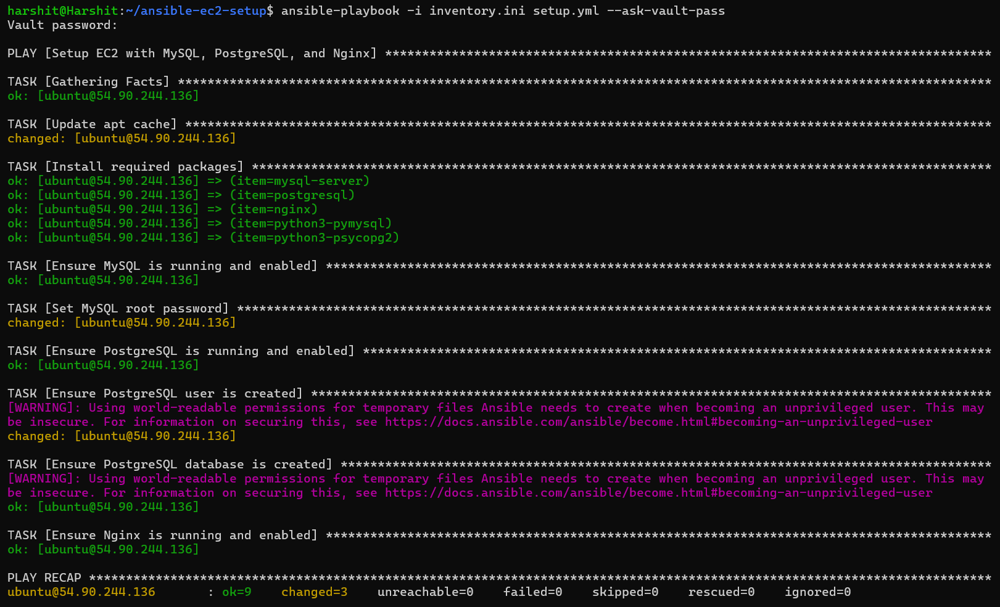
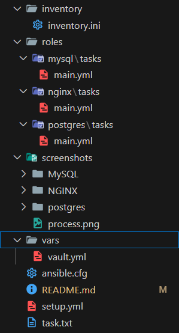
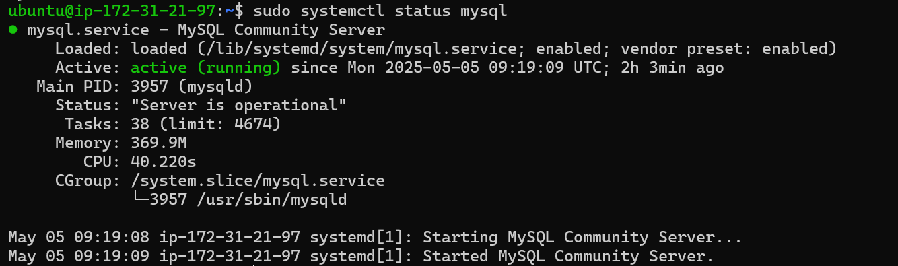
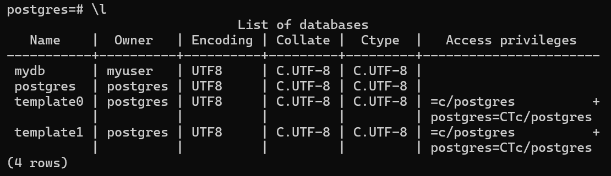
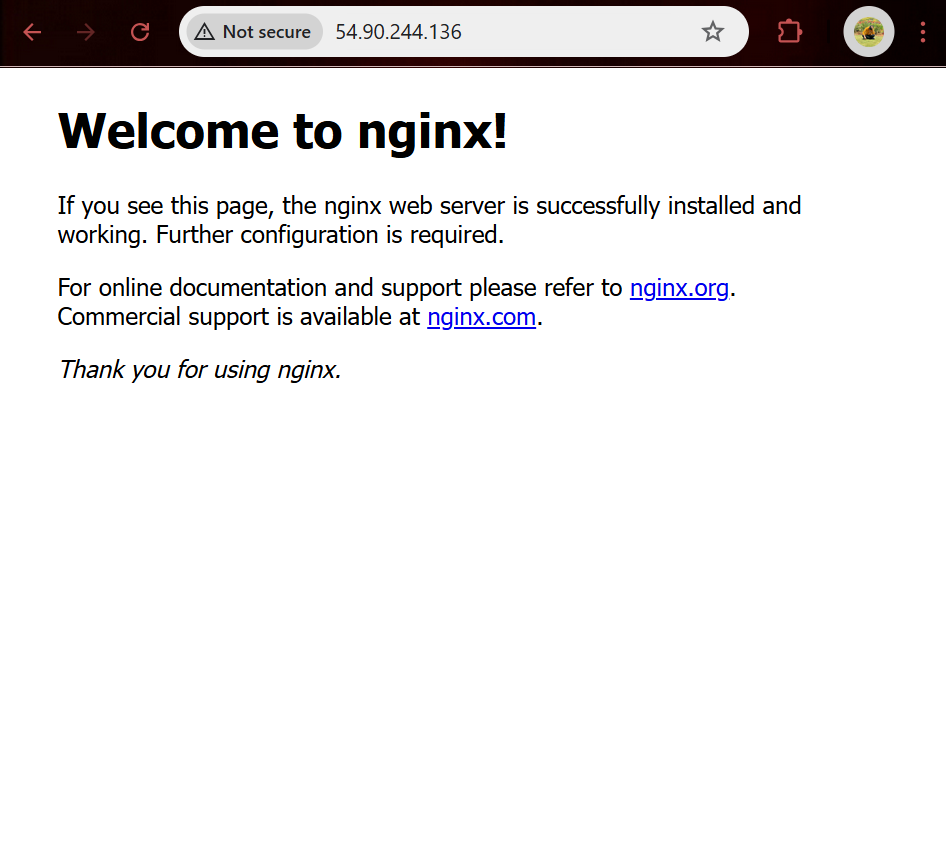

# 🚀 Ansible EC2 Setup: MySQL + PostgreSQL + Nginx (with Vault)

This project demonstrates how to automate the setup of an EC2 instance using **Ansible** to install and configure:

- ✅ MySQL
- ✅ PostgreSQL
- ✅ Nginx  
- 🔐 With **secure passwords** using Ansible Vault


---

## 📁 Project Structure



---

## ✅ Part 1: Launch EC2 Manually (Ubuntu 22.04)

1. Go to AWS Console → EC2 → Launch Instance
2. Fill in:
   - **Name**: `ansible-demo`
   - **AMI**: Ubuntu 22.04 LTS
   - **Instance type**: `t2.micro`
   - **Key Pair**: Create/download `.pem` file
3. Under **Security Group**, allow:
   - SSH (22)
   - HTTP (80)
   - MySQL (3306)
   - PostgreSQL (5432)
4. Click **Launch**
5. After launch, copy the **Public IPv4** of your EC2

---

## ✅ Part 2: Connect to EC2 (Local Machine)

```bash
chmod 400 your-key.pem
ssh -i your-key.pem ubuntu@<ec2-public-ip>
```

 ## Part 3: Install Ansible (Local Machine) and setup
```bash
sudo apt update
sudo apt install ansible -y
mkdir ansible-ec2-setup
cd ansible-ec2-setup
touch setup.yml inventory.ini
```

## Part 5: Create setup.yml

Define Roles to follow and your ansible vault location

## Part 6: Create inventory.ini
```bash
mkdir inventory
cd inventory
touch inventory.ini
```

Write the following in inventory.ini

```bash
[ec2]
ubuntu@<your-ec2-public-ip> ansible_ssh_private_key_file=~/.ssh/your-key.pem ansible_user=ubuntu
```

## Part 7: Create Ansible Vault File
```bash
mkdir vars
cd vars
ansible-vault create vault.yml
```

Paste inside:

```bash
mysql_root_password: "MySQL@123"
postgres_user_password: "Postgres@123"
```
To edit later:

```bash
ansible-vault edit vault.yml
```

## Part 8: Run the Playbook
```bash
ansible-playbook -i inventory/inventory.ini setup.yml --ask-vault-pass

```

This will:

SSH into the EC2 instance

Install MySQL, PostgreSQL, and Nginx

Set secure root passwords via Vault

Enable all services to start on boot

🔗 [Connect with me on LinkedIn]([https://www.linkedin.com/in/your-linkedin-username/](https://www.linkedin.com/in/harshit-khatsuriya-13a607274/))


## ScreenShots






